# Make an Extension To Spawn Primitives

In this document you will be going over how to create an extension inside of Omniverse. Extensions are what Omniverse is made up of. This is ideal for those who are beginners to Omniverse Kit.

## Learning Objectives

- Create an extension
- Use Omni Commands in Omniverse Code
- Make a Functional Button
- Update the Extension's Title and Description
- Docking the Extension Window

# Prerequisites

- [Setup Environment](https://github.com/NVIDIA-Omniverse/ExtensionEnvironmentTutorial/blob/master/Tutorial.md#4-create-a-git-repository)
- Omniverse Code 2022.1.1 or higher


## Step 1: Creating an Extension

Omniverse is made up of all kinds of extensions that were created by developers. In this section you will show how to create an extension and demonstrate how the code gets reflected back into Omniverse.


### Step 1.2: Once Omniverse Code is open select the `Extensions` Manager in the top right.

- You can also view other extensions through this tab. If ```Extensions``` tab is not visible make sure it is checked in the Windows tab.

    

- At the top left find the plus ➕ icon. Click this icon and select ```New Extension Template Project``` to begin creating an extension.

    |  |  |
    |------ |------ |


From here another window will popup prompting on where to place the folder. For this example you will create it in the default location. 

- Once the save location is selected, hit `Create`

    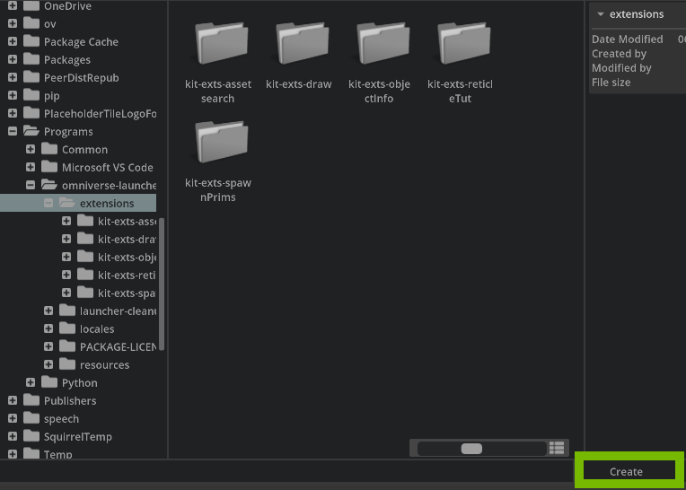

It will prompt for a Project Folder Name and Extension Name. 

- Enter a Project Folder Name and Extension Name.

- For this example choose `kit-exts-spawn-prims` for the Project Folder Name and `omni.example.spawn_prims` for the Extension Name.

| 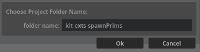 | 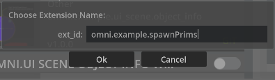 |
| --- | --- |

> 📝 **Note:** Choose the name of an extension differently for publishing. For Example: ```companyName.extdescrip1.descrip2``` 

After choosing the Extension Name two things will happen.

- Visual Studio Code will start up displaying the template code
- A new window will appear called "My Window" in Omniverse


    | 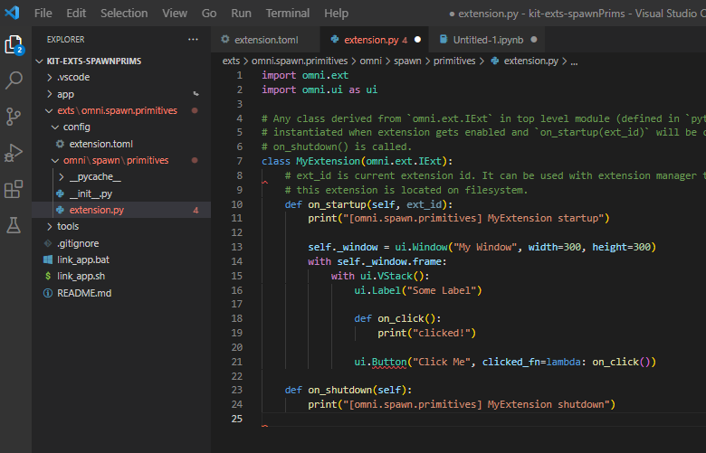 | 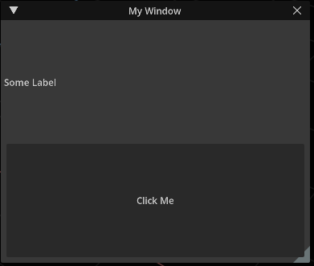 |
    | ------ | ------ |

Now that you created a new extension template, there will be a ```Click Me``` button. When clicked, an output message will appear in the Console Window in Omniverse Code stating that the button was clicked. You will use this button later to spawn a primitive.

Below is a visual to see the button in action.

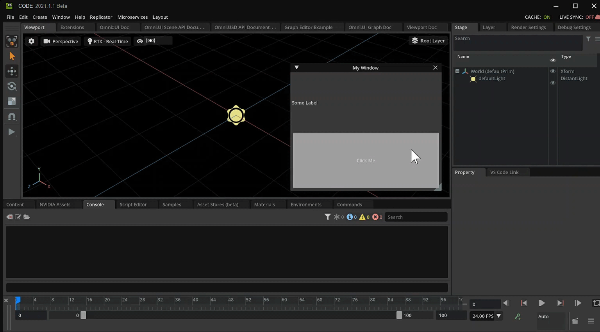


## Step 2: Updating the .toml File

With the extension created you can update the metadata in the `extension.toml`. This is metadata used in the extension details of the Extensions Manager as well as to inform other systems of the Application. Locate the `extension.toml` inside of Visual Studio Code under the `config` folder. The file is called `extension.toml`.

### Step 2.1: Manage the .toml File

Double click `extension.toml` to open it.

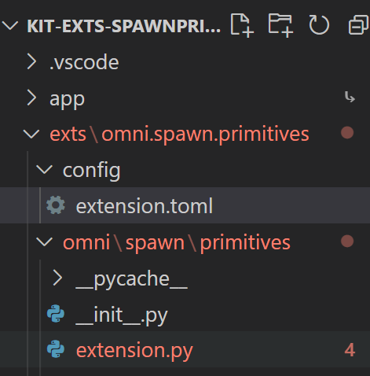

Heres a snippet of what will be inside of extension.toml

    ``` python
    [package]
    # Semantic Versionning is used: https://semver.org/
    version = "1.0.0"

    # The title and description fields are primarily for displaying extension info in UI
    title = "Simple UI Extension Template"
    description="The simplest python extension example. Use it as a starting point for your extensions."

    # Path (relative to the root) or content of readme markdown file for UI.
    readme  = "docs/README.md"

    # URL of the extension source repository.
    repository = ""

    # One of categories for UI.
    category = "Example"

    # Keywords for the extension
    keywords = ["kit", "example"]


    # Use omni.ui to build simple UI
    [dependencies]
    "omni.kit.uiapp" = {}

    # Main python module this extension provides, it will be publicly available as "import omni.hello.world".
    [[python.module]]
    name = "omni.example.spawn_prims"
    ```


### Step 2.2: Name and Describe your Extension

Change the Title and Description in the .toml file.

    ``` python
    title = "Spawn Primitives"
    description="Spawns different primitives utilizing omni kit's commands"
    ```

Save the file and head back over into Omniverse. 

### Step 2.4: Locate the Extension

Select the Extension Tab and search for the title of the Extension.

Once found, select it to pull up its details. 

Here you can see that the title and description are present in the extension details. 

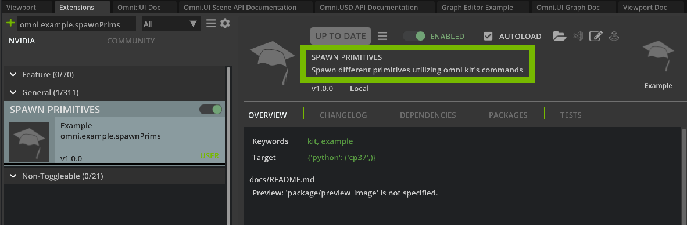

## Step 3: Changing the Functionality

Now that your template is created, you can start editing the source code and see it reflected in Omniverse Code. 

Let's take a look at the source code.

``` python
import omni.ext
import omni.ui as ui

# Any class derived from `omni.ext.IExt` in top level module (defined in `python.modules` of `extension.toml`) will be
# instantiated when extension gets enabled and `on_startup(ext_id)` will be called. Later when extension gets disabled
# on_shutdown() is called.
class MyExtension(omni.ext.IExt):
    # ext_id is current extension id. It can be used with extension manager to query additional information, like where
    # this extension is located on filesystem.
    def on_startup(self, ext_id):
        print("[omni.example.spawn_prims] MyExtension startup")

        self._window = ui.Window("My Window", width=300, height=300)
        with self._window.frame:
            with ui.VStack():
                ui.Label("Some Label")

                def on_click():
                    print("clicked!")

                ui.Button("Click Me", clicked_fn=lambda: on_click())

    def on_shutdown(self):
        print("[omni.example.spawn_prims] MyExtension shutdown")
```

### Step 3.1: Update the Window text

To understand how this template works you will start with changing some values to better reflect what your extension does. 

Edit `ui.Window` to say `Spawn Primitives`.

``` python
        self._window = ui.Window("Spawn Primitives", width=300, height=300)
```

### Step 3.2: Update the Label

Remove the line `ui.Label("Some Label")`

``` python
        self._window = ui.Window("Spawn Primitives", width=300, height=300)
        with self._window.frame:
            with ui.VStack():
                
                ui.Label("Some Label") # DELETE THIS LINE
                
                def on_click():
                    print("clicked!")
```
### Step 3.3: Update the Button Text

Update the Button's text via `ui.Button` to say `Spawn Cube`.


``` python
                ui.Button("Spawn Cube", clicked_fn=lambda: on_click())
```

### Step 3.4: Review Changes

After making the above changes your code should appear as follows:

``` python
import omni.ext
import omni.ui as ui

# Any class derived from `omni.ext.IExt` in top level module (defined in `python.modules` of `extension.toml`) will be
# instantiated when extension gets enabled and `on_startup(ext_id)` will be called. Later when extension gets disabled
# on_shutdown() is called.
class MyExtension(omni.ext.IExt):
    # ext_id is current extension id. It can be used with extension manager to query additional information, like where
    # this extension is located on filesystem.
    def on_startup(self, ext_id):
        print("[omni.example.spawn_prims] MyExtension startup")

        self._window = ui.Window("Spawn Primitives", width=300, height=300)
        with self._window.frame:
            with ui.VStack():

                def on_click():
                    print("clicked!")

                ui.Button("Spawn Cube", clicked_fn=lambda: on_click())

    def on_shutdown(self):
        print("[omni.example.spawn_prims] MyExtension shutdown")
```

Save the file. 

In Omniverse Code, you will be able to see your new window with a large button saying "Spawn Cube".


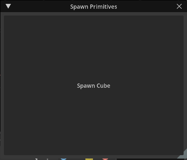

### Step 4 Dock the Extension Window

Omniverse allows you to move extensions and dock them in any location. In order to dock the extensions simply click, hold, and drag to a desired location.


## Step 5: Spawning the Cube

Currently, the button text is a bit misleading. It says "Spawn Cube", however, it will not spawn a cube. You will now add Kit commands to accomplish this goal.

**Omniverse Commands Intro**

Commands are actions that take place inside of Omniverse. A simple command could be creating an object or changing a color. Commands are composed of a `do` and an `undo` feature. To read more about what commands are and how to create custom commands go [here](https://docs.omniverse.nvidia.com/py/kit/source/extensions/omni.kit.commands/docs/index.html).

Omniverse allows users and developers to see what commands are taking place as they work in the application. On the right side, there will be a window called `Commands` and this is where you can visually see what commands are taking place as you work. 

### Step 5.1: 

Move the Commands window to get a better view or dock somewhere convenient.

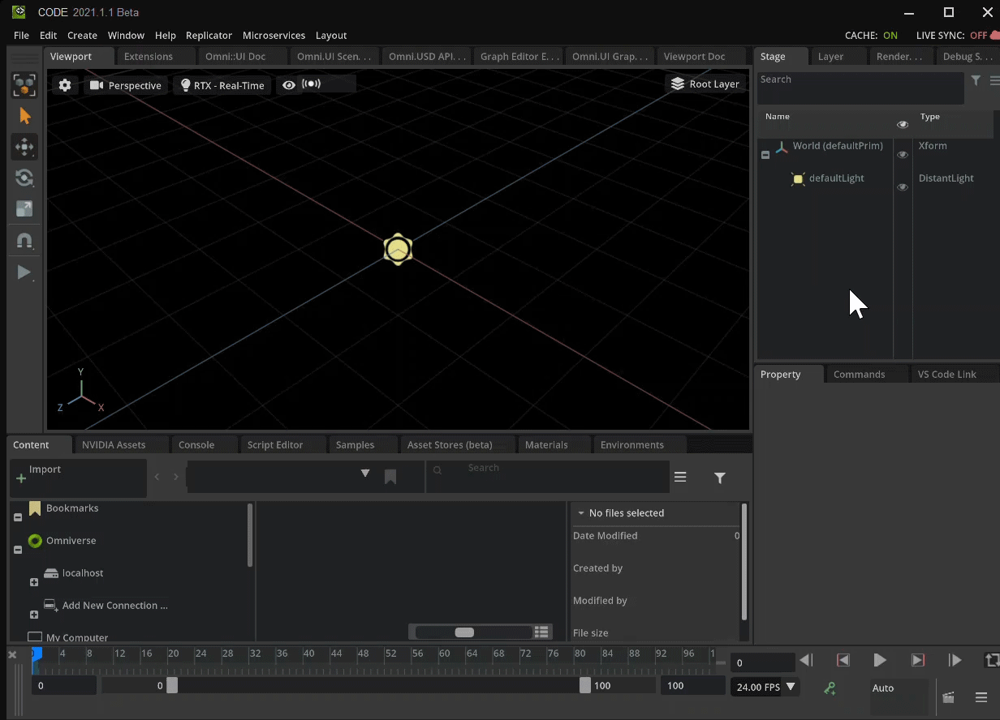

### Step 5.2: Clear old Commands

Select the `Clear History` button located in the Commands Window.  This will make it easier to see what action takes place when you try to create a cube. 

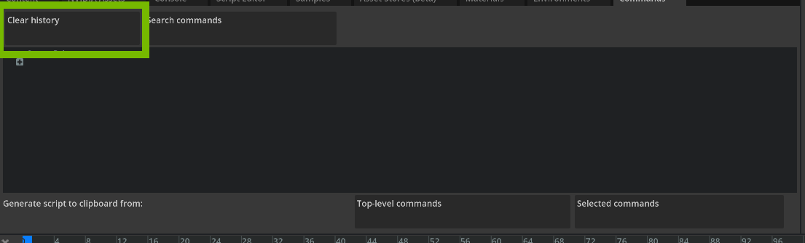

### Step 5.2 Getting the Command Code

Now that you have the necessary tools, let's see how you can grab one of these commands and use it in the extension. The first thing you are going to do is create a cube. There are different ways on how to create the cube but for this example you will go to the top bar.

### Step 5.3: Create a Cube

Select `Create > Mesh > Cube` from the top bar. 

After selecting `Cube` you should see a `Cube` was created in the `Viewport` and a new line added to the `Commands Window`. 

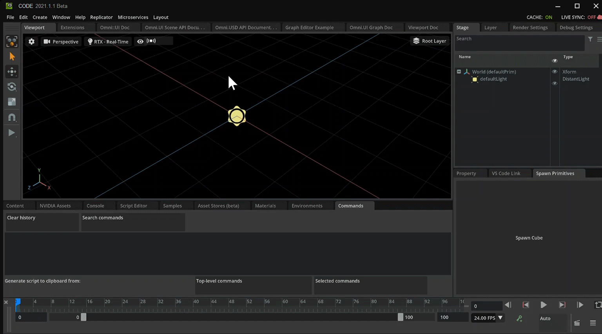

### Step 5.4: Copy the Create Mesh Command

Click to select the new line `CreateMeshPrimWithDefaultXform` in the Command Window. 

With `CreateMeshPrimWithDefaultXform` selected, click the `Selected Commands` button to copy the command to the Clipboard.

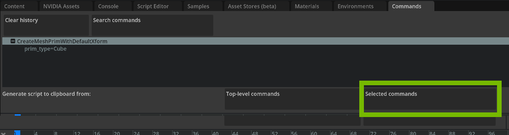


### Step 5.5: Using the Command in an Extension

Switch focus from `omniverse Code` to `VS Code`.

Paste the copied command into the bottom of the `extension.py` file. 

The code should have the following after pasting:

    ``` python
    import omni.ext
    import omni.ui as ui

    # Any class derived from `omni.ext.IExt` in top level module (defined in `python.modules` of `extension.toml`) will be
    # instantiated when extension gets enabled and `on_startup(ext_id)` will be called. Later when extension gets disabled
    # on_shutdown() is called.
    class MyExtension(omni.ext.IExt):
        # ext_id is current extension id. It can be used with extension manager to query additional information, like where
        # this extension is located on filesystem.
        def on_startup(self, ext_id):
            print("[omni.example.spawn_prims] MyExtension startup")

            self._window = ui.Window("Spawn Primitives", width=300, height=300)
            with self._window.frame:
                with ui.VStack():

                    def on_click():
                        print("clicked!")

                    ui.Button("Spawn Cube", clicked_fn=lambda: on_click())

        def on_shutdown(self):
            print("[omni.example.spawn_prims] MyExtension shutdown")

    import omni.kit.commands

    omni.kit.commands.execute('CreateMeshPrimWithDefaultXform',
        prim_type='Cube')

    ```

Notice there is a new import as well as the command which creates a cube.

    ``` python
    import omni.kit.commands

    omni.kit.commands.execute('CreateMeshPrimWithDefaultXform',
        prim_type='Cube')
    ```

### Step 5.6: Group Imports at the Top

Move the `import omni.kit.commands` to the top of the module with the other imports.

    ```python
    import omni.ext
    import omni.ui as ui
    import omni.kit.commands
    ```

### Step 5.7: Relocate Create Command

Place `omni.kit.commands.execute()` inside the `on_click()` definition.

``` python
                def on_click():
                    omni.kit.commands.execute('CreateMeshPrimWithDefaultXform',
                        prim_type='Cube')
                    print("clicked!")
```

#### Step 5.8: Review and Save

Review this code snippet and check for parity.

``` python
import omni.ext
import omni.ui as ui
import omni.kit.commands

# Any class derived from `omni.ext.IExt` in top level module (defined in `python.modules` of `extension.toml`) will be
# instantiated when extension gets enabled and `on_startup(ext_id)` will be called. Later when extension gets disabled
# on_shutdown() is called.
class MyExtension(omni.ext.IExt):
    # ext_id is current extension id. It can be used with extension manager to query additional information, like where
    # this extension is located on filesystem.
    def on_startup(self, ext_id):
        print("[omni.example.spawn_prims] MyExtension startup")

        self._window = ui.Window("Spawn Primitives", width=300, height=300)
        with self._window.frame:
            with ui.VStack():

                def on_click():
                    omni.kit.commands.execute('CreateMeshPrimWithDefaultXform',
                        prim_type='Cube')
                    print("clicked!")

                ui.Button("Spawn Cube", clicked_fn=lambda: on_click())

    def on_shutdown(self):
        print("[omni.example.spawn_prims] MyExtension shutdown")
```

Save your code and switch focus back to Omniverse.

### Step 5.9: Testing 

Test the extension by hitting the `Spawn Cube` button.

Now that you have more functionality in the `on_click` function, you should again test. Press the `Spawn Cube` button in the Extension Window. 

You should see that a new Cube Prim is created with each button press.
 
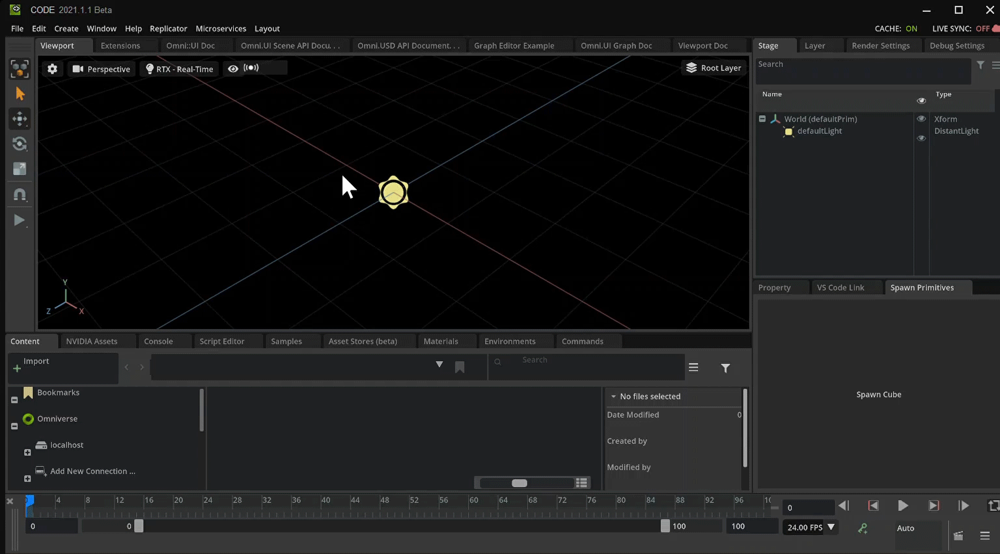

Excellent, you now know how to spawn a cube using a function.  Whats more, you didnt have to reference anything as Omniverse Code was kind enough to deliver everything you needed.

Continuing on and via same methods you will now construct a second button spawning a cone in the same interface.

## Step 6: Spawn a Cone

Similar to before, you will need to spawn another mesh.  
### Step 6.1: Add a Button

Add the line `ui.Button("Spawn Cone", clicked_fn=lambda: on_click())` below the spawn cube button.

### Step 6.2: Review and Save

``` python
    def on_startup(self, ext_id):
        print("[omni.spawn.primitives] MyExtension startup")

        self._window = ui.Window("Spawn Primitives", width=300, height=300)
        with self._window.frame:
            with ui.VStack():

                def on_click():
                    omni.kit.commands.execute('CreateMeshPrimWithDefaultXform',
                        prim_type='Cube')
                    print("clicked!")

                ui.Button("Spawn Cube", clicked_fn=lambda: on_click())
                ui.Button("Spawn Cone", clicked_fn=lambda: on_click())
```

Save the file then switch focus to Omniverse.

Notice that both buttons use the same function therefore both currently spawn a `Cube` despite their labels.


## Step 7: Create a Cone from the Menu

Using the interface in Omniverse Code, create a Cone.

### Step 7.1: Create the Mesh

Select `Create > Mesh > Cone` on the tab bar.

### Step 7.2: Copy the Commands to your Extension

Copy the command in the `Commands` tab with the `Selected Commands` button.

Paste the code into `extensions.py` inside of Visual Studio Code.

Once you have copied and pasted the command into Visual Studio Code, compare the difference between the two.

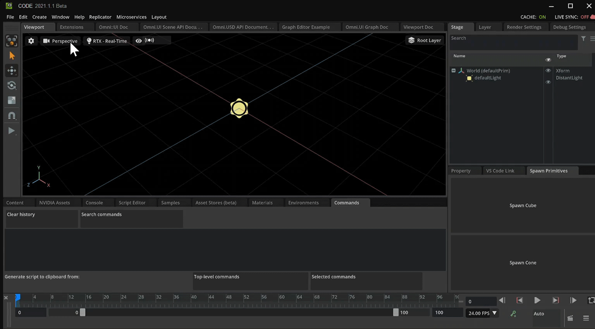


``` python
                def on_click():
                    #Create a Cube
                    omni.kit.commands.execute('CreateMeshPrimWithDefaultXform',
                        prim_type='Cube')

                    #Create a Cone
                    omni.kit.commands.execute('CreateMeshPrimWithDefaultXform',
                        prim_type='Cone')

                    print("clicked!")
```

Notice that the command is the same and only the value for `prim_type` is different. 

To Spawn cube you need to pass `'Cube'`
To Spawn a cone you need to pass `'Cone'`

``` python
#Create a Cube
omni.kit.commands.execute('CreateMeshPrimWithDefaultXform',
    prim_type='Cube')

#Create a Cone
omni.kit.commands.execute('CreateMeshPrimWithDefaultXform',
    prim_type='Cone')
```

### Step 8: Updating on_click() 

Update `on_click()` to work for multiple buttons.

### Step 8.1: Change what gets passed to `on_click`

Add an argument to `on_click()` called `prim_type`.

``` python
def on_click(prim_type):
```
This value will be used as part of the command execution. You should only have one execute command function call.

Remove the `execute()` for creating a `Cone`.

### Step 8.2: Replace Prim Type 

Replace `prim_type='Cube'` with `prim_type=prim_type`.

``` python
omni.kit.commands.execute('CreateMeshPrimWithDefaultXform',
    prim_type=prim_type)
```

## Step 8.3: Review and Save

The code should look like the following after the changes:

``` python

                def on_click(prim_type):
                    omni.kit.commands.execute('CreateMeshPrimWithDefaultXform',
                        prim_type=prim_type)

                    print("clicked!")
```


## Step 8.4: Update the Buttons

Locate the two `on_click()` fuction calls.

Update the `clicked_fn` for both UI Buttons. 


``` python

                ui.Button("Spawn Cube", clicked_fn=lambda: on_click("Cube"))
                ui.Button("Spawn Cone", clicked_fn=lambda: on_click("Cone"))
        
```

### Step 8.5: Save and Test

Save the file and test the updates to your __Spawn Primitives__ window.


## Step 9: Conclusion

Ok, you have successfully created a second button that spawns a second mesh all within the same extension.  This of course can be expanded upon.  

### 9.1: Bonus Points
As a continued challenge, feel free to add a button for every mesh type on your own.  
It is fun and makes for good practice.   


Below you can find a completed "cheat sheet" if you need help or just want to copy it for your own use.


---

<details> 
    <summary><b>Click to show the Final Code</b></summary>
    
``` python

import omni.ext
import omni.ui as ui
import omni.kit.commands

# Any class derived from `omni.ext.IExt` in top level module (defined in `python.modules` of `extension.toml`) will be
# instantiated when extension gets enabled and `on_startup(ext_id)` will be called. Later when extension gets disabled
# on_shutdown() is called.
class MyExtension(omni.ext.IExt):
    # ext_id is current extension id. It can be used with extension manager to query additional information, like where
    # this extension is located on filesystem.
    def on_startup(self, ext_id):
        print("[omni.example.spawn_prims] MyExtension startup")

        self._window = ui.Window("Spawn Primitives", width=300, height=300)
        with self._window.frame:
            with ui.VStack():

                def on_click(prim_type):
                    omni.kit.commands.execute('CreateMeshPrimWithDefaultXform',
                        prim_type=prim_type)

                    print("clicked!")

                ui.Button("Spawn Cube", clicked_fn=lambda: on_click("Cube"))
                ui.Button("Spawn Cone", clicked_fn=lambda: on_click("Cone"))
                ui.Button("Spawn Cylinder", clicked_fn=lambda: on_click("Cylinder"))
                ui.Button("Spawn Disk", clicked_fn=lambda: on_click("Disk"))
                ui.Button("Spawn Plane", clicked_fn=lambda: on_click("Plane"))
                ui.Button("Spawn Sphere", clicked_fn=lambda: on_click("Sphere"))
                ui.Button("Spawn Torus", clicked_fn=lambda: on_click("Torus"))

    def on_shutdown(self):
        print("[omni.example.spawn_prims] MyExtension shutdown")

```
    
</details>

---
