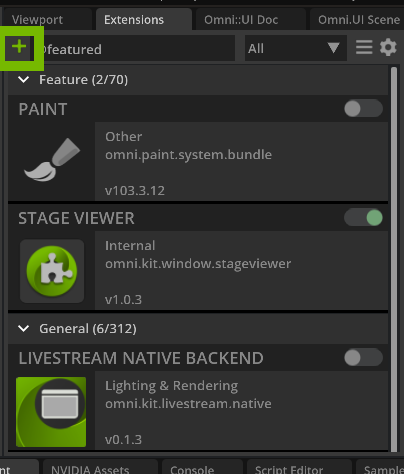
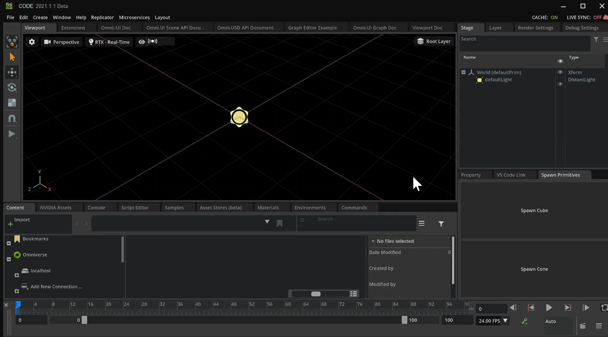
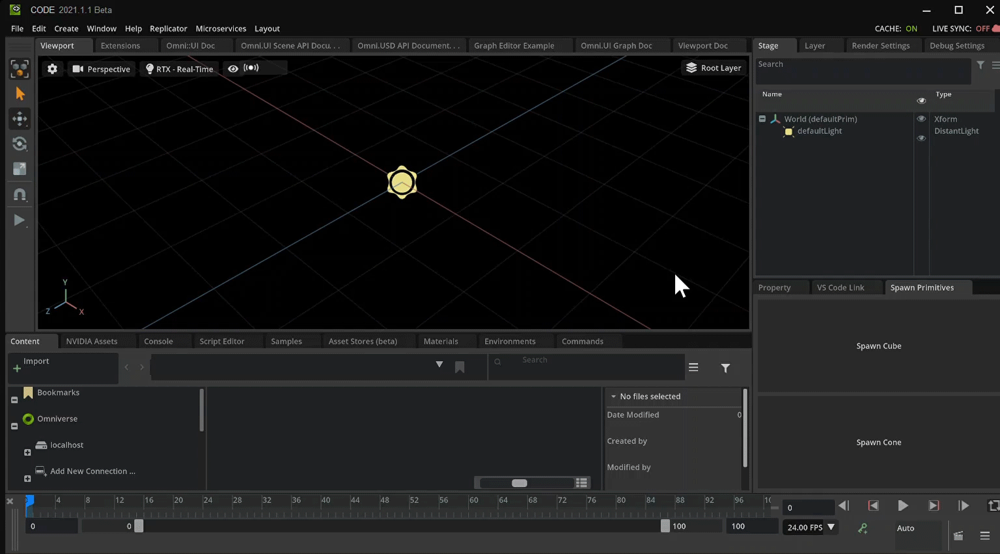
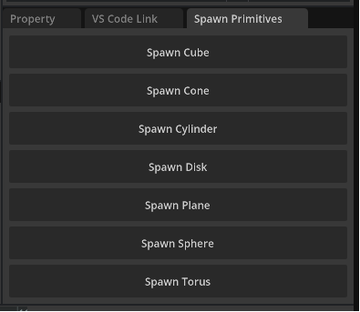

# Make an Extension To Spawn Primitives

In this document you will be going over how to create an extension inside of Omniverse. Extensions are what Omniverse is made up of. This is ideal for those who are begineers to Omniverse Kit.

## Learning Objectives

- Create an extension
- Use Omni Commands in Omniverse Code
- Make a Functional Button
- Update the Extension's Title and Description
- Docking the Extension Window

# Prerequisites

- [Setup Environment](https://github.com/NVIDIA-Omniverse/ExtensionEnvironmentTutorial/blob/master/Tutorial.md#4-create-a-git-repository)
- Omniverse Code 2022.1.1 or higher


## Step 1: Creating an Extension

Omniverse is made up of all kinds of extensions that were created by developers. In this section you will show how to create an extension and demonstrate how the code gets reflected back into Omniverse.


### Step 1.2: Once Omniverse Code is open select the `Extensions` Manager in the top right.

- You can also view other extensions through this tab. If ```Extensions``` tab is not visible make sure it is checked in the Windows tab.

    

- At the top left find the plus ➕ icon. Click this icon and select ```New Extension Template Project``` to begin creating an extension.

    |  |  |
    |------ |------ |


From here another window will popup prompting on where to place the folder. For this example you will create it in the default location. 

- Once the save location is selected, hit `Create`

    

It will prompt for a Project Folder Name and Extension Name. 

- Enter a Project Folder Name and Extension Name.

- For this example choose `kit-exts-spawnPrims` for the Project Folder Name and `omni.spawn.primitive` for the Extension Name.

|  |  |
| --- | --- |

> 📝 **Note:** Choose the name of an extension differently for publishing. For Example: ```companyName.extdescrip1.descrip2``` 

After choosing the Extension Name two things will happen.

- Visual Studio Code will start up displaying the template code
- A new window will appear called "My Window" in Omniverse


    |  |  |
    | ------ | ------ |

Now that you created a new extension template, there will be a ```Click Me``` button. When clicked, a message in the Console Window in Omniverse Code recording that the button was clicked. You will use this button later to spawn a primitive.

Below is a visual to see the button in action.


## Step 2: Updating the .toml File

With the extension created you can also update how our extension will be viewed in the Extensions Tab. This is all done inside of the .toml file that comes with the template extension. Locate it inside of Visual Studio Code under the `config` folder. The file is called `extension.toml`.

### Step 2.1: Manage the .toml File

Double click `extension.toml` to open it.


Heres a snippet of what will be inside of extension.toml

    ``` python
    [package]
    # Semantic Versionning is used: https://semver.org/
    version = "1.0.0"

    # The title and description fields are primarily for displaying extension info in UI
    title = "Simple UI Extension Template"
    description="The simplest python extension example. Use it as a starting point for your extensions."

    # Path (relative to the root) or content of readme markdown file for UI.
    readme  = "docs/README.md"

    # URL of the extension source repository.
    repository = ""

    # One of categories for UI.
    category = "Example"

    # Keywords for the extension
    keywords = ["kit", "example"]


    # Use omni.ui to build simple UI
    [dependencies]
    "omni.kit.uiapp" = {}

    # Main python module this extension provides, it will be publicly available as "import omni.hello.world".
    [[python.module]]
    name = "omni.spawn.primitives"
    ```


### Step 2.2: Name and Describe your Extension

Change the Title and Description in the .toml file.

    ``` python
    title = "Spawn Primitives"
    description="Spawns different primitives utilizing omni kit's commands"
    ```

Save the file and head back over into Omniverse. 

### Step 2.4: Locate the Extension

Select the Extension Tab and search for the title of the Extension

Once found, select it to pull up it's information. 

Here we can see that the title and description are present in the extension info. 


## Step 3: Changing the Functionality

Now that your template is created, you can start changing some parts in the code and see it reflected in our extension. 

Let's take a look at the code.

``` python
import omni.ext
import omni.ui as ui

# Any class derived from `omni.ext.IExt` in top level module (defined in `python.modules` of `extension.toml`) will be
# instantiated when extension gets enabled and `on_startup(ext_id)` will be called. Later when extension gets disabled
# on_shutdown() is called.
class MyExtension(omni.ext.IExt):
    # ext_id is current extension id. It can be used with extension manager to query additional information, like where
    # this extension is located on filesystem.
    def on_startup(self, ext_id):
        print("[omni.spawn.primitives] MyExtension startup")

        self._window = ui.Window("My Window", width=300, height=300)
        with self._window.frame:
            with ui.VStack():
                ui.Label("Some Label")

                def on_click():
                    print("clicked!")

                ui.Button("Click Me", clicked_fn=lambda: on_click())

    def on_shutdown(self):
        print("[omni.spawn.primitives] MyExtension shutdown")
```

### Step 3.1: Update the Window text

To understand how this template works you will start with changing some values to better reflect what your extension does. 

Edit `ui.Window` to say `Spawn Primitives`.

``` python
        self._window = ui.Window("Spawn Primitives", width=300, height=300)
```

### Step 3.2: Update the Label

Remove the line `ui.Label("Some Label")`

``` python
        self._window = ui.Window("Spawn Primitives", width=300, height=300)
        with self._window.frame:
            with ui.VStack():
                
                ui.Label("Some Label") # DELETE THIS LINE
                
                def on_click():
                    print("clicked!")
```
### Step 3.3: Update the Button Text

Update the Button's text via `ui.Button` to say `Spawn Cube`.


``` python
                ui.Button("Spawn Cube", clicked_fn=lambda: on_click())
```

### Step 3.4: Review Changes

After making the above changes your code should appear as follows:

``` python
import omni.ext
import omni.ui as ui

# Any class derived from `omni.ext.IExt` in top level module (defined in `python.modules` of `extension.toml`) will be
# instantiated when extension gets enabled and `on_startup(ext_id)` will be called. Later when extension gets disabled
# on_shutdown() is called.
class MyExtension(omni.ext.IExt):
    # ext_id is current extension id. It can be used with extension manager to query additional information, like where
    # this extension is located on filesystem.
    def on_startup(self, ext_id):
        print("[omni.spawn.primitives] MyExtension startup")

        self._window = ui.Window("Spawn Primitives", width=300, height=300)
        with self._window.frame:
            with ui.VStack():

                def on_click():
                    print("clicked!")

                ui.Button("Spawn Cube", clicked_fn=lambda: on_click())

    def on_shutdown(self):
        print("[omni.spawn.primitives] MyExtension shutdown")
```

Save the file. 

In Omniverse Code, you will be able to see your new window with a large button saying "Spawn Cube".


### Step 4 Dock the Extension Window

Omniverse allows you to move extensions and dock them in any location. In order to dock the extensions simply click, hold, and drag to a desired location.


## Step 5: Spawning the Cube

Currently, the button right is a bit misleading. It says "Spawn Cube", however, it will not spawn a cube. You will now add Kit commands to accomplish this goal.

**Omniverse Commands Intro**

Commands are actions that take place inside of Omniverse. A simple command could be creating an object or changing a color. Commands are composed of a `do` and an `undo` feature. To read more about what commands are and how to create custom commands go [here](https://docs.omniverse.nvidia.com/py/kit/source/extensions/omni.kit.commands/docs/index.html).

Omniverse allows users / developers to see what commands are taking place as they work in the application. On the right side, there will be a window called `Commands` and this is where we can visually see what commands are taking place as we work. 

### Step 5.1: 

Move the Commands window to get a better view or dock somewhere convenient.


### Step 5.2: Clear old Commands

Select the `Clear History` button located in the Commands Window.  This will make it easier to see what action takes place when you try to create a cube. 


### Step 5.2 Getting the Command Code

Now that we have the necessary tools, let's see how we can grab one of these commands and use it in our extension. The first thing we are going to do is create a cube. There are different ways on how to create our cube but for this example we will go to the top bar.

### Step 5.3: Create a Cube

Select `Create > Mesh > Cube` from the top bar. 

After selecting `Cube` we should see a `Cube` was created in the `Viewport` and a new line added to the `Commands Window`. 


### Step 5.4: Copy the Create Mesh Command

Click to select the new line `CreateMeshPrimWithDefaultXform` in the Command Window. 

With `CreateMeshPrimWithDefaultXform` selected, click the `Selected Commands` button to copy the command to the Clipboard.


### Step 5.5: Using the Command in an Extension

Switch focus from `omniverse Code` to `VS Code`.

Paste the coppied command into the bottom of the `extension.py` file. 

The code should have the following after pasting:

    ``` python
    import omni.ext
    import omni.ui as ui

    # Any class derived from `omni.ext.IExt` in top level module (defined in `python.modules` of `extension.toml`) will be
    # instantiated when extension gets enabled and `on_startup(ext_id)` will be called. Later when extension gets disabled
    # on_shutdown() is called.
    class MyExtension(omni.ext.IExt):
        # ext_id is current extension id. It can be used with extension manager to query additional information, like where
        # this extension is located on filesystem.
        def on_startup(self, ext_id):
            print("[omni.spawn.primitives] MyExtension startup")

            self._window = ui.Window("Spawn Primitives", width=300, height=300)
            with self._window.frame:
                with ui.VStack():

                    def on_click():
                        print("clicked!")

                    ui.Button("Spawn Cube", clicked_fn=lambda: on_click())

        def on_shutdown(self):
            print("[omni.spawn.primitives] MyExtension shutdown")

    import omni.kit.commands

    omni.kit.commands.execute('CreateMeshPrimWithDefaultXform',
        prim_type='Cube')

    ```

Notice there is a new import as well as the command which create's a cube.

    ``` python
    import omni.kit.commands

    omni.kit.commands.execute('CreateMeshPrimWithDefaultXform',
        prim_type='Cube')
    ```

### Step 5.6: Group Imports at Top

Move the `import omni.kit.commands` to the top with the other imports.

    ```python
    import omni.ext
    import omni.ui as ui
    import omni.kit.commands
    ```

### Step 5.7: Relocate Create Command

Place `omni.kit.commands.execute('CreateMeshPrimWithDefaultXform` inside the `on_click` function.

``` python
                def on_click():
                    omni.kit.commands.execute('CreateMeshPrimWithDefaultXform',
                        prim_type='Cube')
                    print("clicked!")
```

#### Step 5.8: Review and Save

Review this code snippet and check for parity.

``` python
import omni.ext
import omni.ui as ui
import omni.kit.commands

# Any class derived from `omni.ext.IExt` in top level module (defined in `python.modules` of `extension.toml`) will be
# instantiated when extension gets enabled and `on_startup(ext_id)` will be called. Later when extension gets disabled
# on_shutdown() is called.
class MyExtension(omni.ext.IExt):
    # ext_id is current extension id. It can be used with extension manager to query additional information, like where
    # this extension is located on filesystem.
    def on_startup(self, ext_id):
        print("[omni.spawn.primitives] MyExtension startup")

        self._window = ui.Window("Spawn Primitives", width=300, height=300)
        with self._window.frame:
            with ui.VStack():

                def on_click():
                    omni.kit.commands.execute('CreateMeshPrimWithDefaultXform',
                        prim_type='Cube')
                    print("clicked!")

                ui.Button("Spawn Cube", clicked_fn=lambda: on_click())

    def on_shutdown(self):
        print("[omni.spawn.primitives] MyExtension shutdown")
```

Save your code and switch focus back to Omniverse.

### Step 5.9: Testing 

Test the extension by hitting the `Spawn Cube` button.

Now that we have gave a bit more functionality to our `on_click` function, lets give it a test. Press the `Spawn Cube` button on our Extension Window. After pressing it we] should see the same functionality for creating a cube so now every time we press `Spawn Cube` it will do the same function as `Create > Mesh > Cube`.
 


Now that you know how to spawn a cube, the challenge is can we spawn a cone? Write the rest of the code to spawn a cone or even spawning all different kinds of Meshs and check in the conclusion section on how we implemented it. 

If more guidance is needed on how to spawn another mesh keep following along.

## Step 6: Spawn a Cone

We know how to spawn a cube but there are still some other Meshs we can spawn, for example a cone. Well how can we spawn a cone? Let's first start with getting another button that is separate from `Spawn Cube`. This time we will call it `Spawn Cone`.

### Step 6.1: Add a Button

Add the line `ui.Button("Spawn Cone", clicked_fn=lambda: on_click())` below the spawn cube button.

### Step 6.2: Review and Save

``` python
    def on_startup(self, ext_id):
        print("[omni.spawn.primitives] MyExtension startup")

        self._window = ui.Window("Spawn Primitives", width=300, height=300)
        with self._window.frame:
            with ui.VStack():

                def on_click():
                    omni.kit.commands.execute('CreateMeshPrimWithDefaultXform',
                        prim_type='Cube')
                    print("clicked!")

                ui.Button("Spawn Cube", clicked_fn=lambda: on_click())
                ui.Button("Spawn Cone", clicked_fn=lambda: on_click())
```

Save the file then switch focus to Omniverse.

Notice that both buttons use the same function and both are Spawn a `Cube`.



## Step 7: Create a Cone

Just like how we go the command for creating a Cube, let's get the command for creating a cone. 

### Step 7.1: Create the Mesh

Select `Create > Mesh > Cone` on the tab bar.

### Step 7.2: Copy the Commands to your Extension

Copy the command in the `Commands` tab with the `Selected Commands` button.

Paste the code into `extensions.py` inside of Visual Studio Code.

Once the command has been copied and pasted that into Visual Studio Code, we shall compare the different between the two.


``` python
                def on_click():
                    #Create a Cube
                    omni.kit.commands.execute('CreateMeshPrimWithDefaultXform',
                        prim_type='Cube')

                    #Create a Cone
                    omni.kit.commands.execute('CreateMeshPrimWithDefaultXform',
                        prim_type='Cone')

                    print("clicked!")
```


It appears that the command is the same and only the value for `prim_type` is different. For cube we need to pass `'Cube'` and for cone we need to pass `'Cone'`.

``` python
#Create a Cube
omni.kit.commands.execute('CreateMeshPrimWithDefaultXform',
    prim_type='Cube')

#Create a Cone
omni.kit.commands.execute('CreateMeshPrimWithDefaultXform',
    prim_type='Cone')
```

### Step 8: Updating on_click() 

Hereyou will update the on click event to work for multiple buttons.

### Step 8.1: Change what gets passed to `on_click`

Add a parameter to the function `on_click` called `prim_type`.

``` python
def on_click(prim_type):
```
This value will be used as part of the command execution. We should only have one execute command function call.

Remove the `execute()` for creating a `Cone`.

### Step 8.2: Replace Prim Type 

Replace `prim_type='Cube'` with `prim_type=prim_type`.

``` python
omni.kit.commands.execute('CreateMeshPrimWithDefaultXform',
    prim_type=prim_type)
```

## Step 8.3: Review and Save

The code should look like the following after the changes:

``` python

                def on_click(prim_type):
                    omni.kit.commands.execute('CreateMeshPrimWithDefaultXform',
                        prim_type=prim_type)

                    print("clicked!")
```


## Step 8.4: Update the Buttons

Now head back to where you create the buttons and  pass the appropriate value for Cube and Cone.

Update the `clicked_fn` for both UI Buttons. The two function calls should look like `on_click("Cube")` and `on_click("Cone")`.

``` python

                ui.Button("Spawn Cube", clicked_fn=lambda: on_click("Cube"))
                ui.Button("Spawn Cone", clicked_fn=lambda: on_click("Cone"))
        
```


### Step 8.5: Save and Test

Save the file and check in Omniverse on how our new extension works.



## Step 9: Conclusion

You were able to create an extension utilizing the template. Congratulations!  What Now?

This example only covered the two Meshs.  It is however, possible to code the other Mesh types as well.  Try challenging yourself with adding all the additional mesh types found in Omniverse.

It would look something like this:



Though you should try doing this bit on your own,  the full code for this task is below should you need some help.

---

<details> 
    <summary><b>Click to show the Final Code</b></summary>
    
``` python

import omni.ext
import omni.ui as ui
import omni.kit.commands

# Any class derived from `omni.ext.IExt` in top level module (defined in `python.modules` of `extension.toml`) will be
# instantiated when extension gets enabled and `on_startup(ext_id)` will be called. Later when extension gets disabled
# on_shutdown() is called.
class MyExtension(omni.ext.IExt):
    # ext_id is current extension id. It can be used with extension manager to query additional information, like where
    # this extension is located on filesystem.
    def on_startup(self, ext_id):
        print("[omni.spawn.primitives] MyExtension startup")

        self._window = ui.Window("Spawn Primitives", width=300, height=300)
        with self._window.frame:
            with ui.VStack():

                def on_click(prim_type):
                    omni.kit.commands.execute('CreateMeshPrimWithDefaultXform',
                        prim_type=prim_type)

                    print("clicked!")

                ui.Button("Spawn Cube", clicked_fn=lambda: on_click("Cube"))
                ui.Button("Spawn Cone", clicked_fn=lambda: on_click("Cone"))
                ui.Button("Spawn Cylinder", clicked_fn=lambda: on_click("Cylinder"))
                ui.Button("Spawn Disk", clicked_fn=lambda: on_click("Disk"))
                ui.Button("Spawn Plane", clicked_fn=lambda: on_click("Plane"))
                ui.Button("Spawn Sphere", clicked_fn=lambda: on_click("Sphere"))
                ui.Button("Spawn Torus", clicked_fn=lambda: on_click("Torus"))

    def on_shutdown(self):
        print("[omni.spawn.primitives] MyExtension shutdown")

```
    
</details>

---
