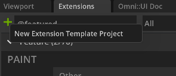
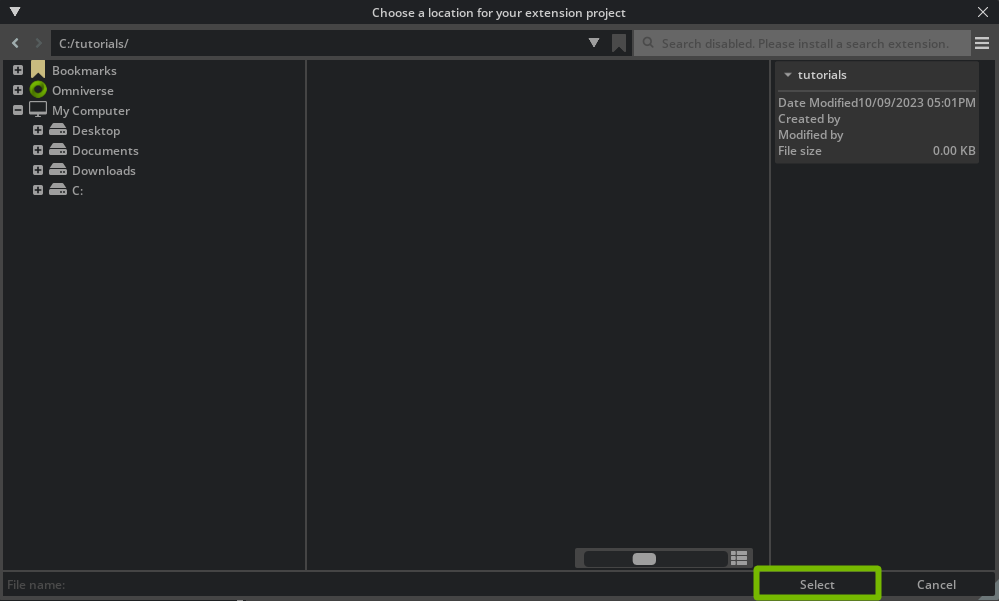
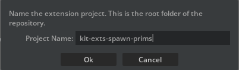
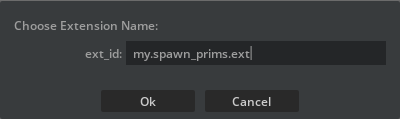
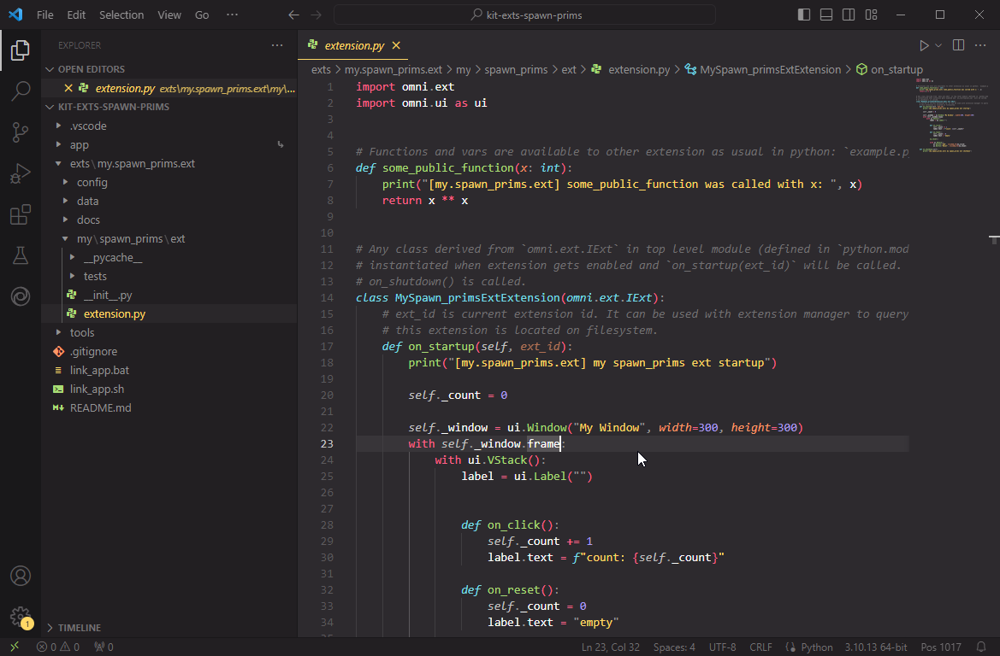
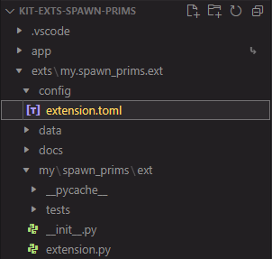
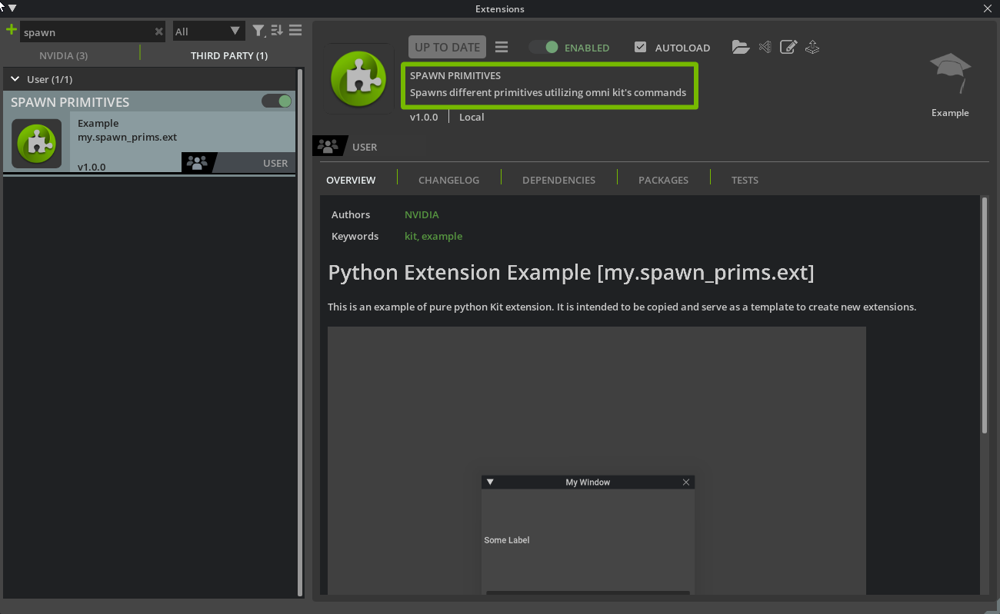
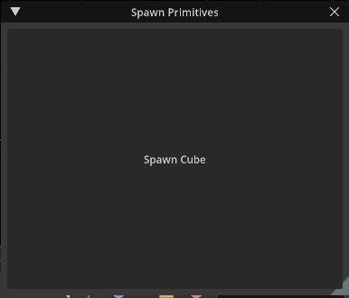
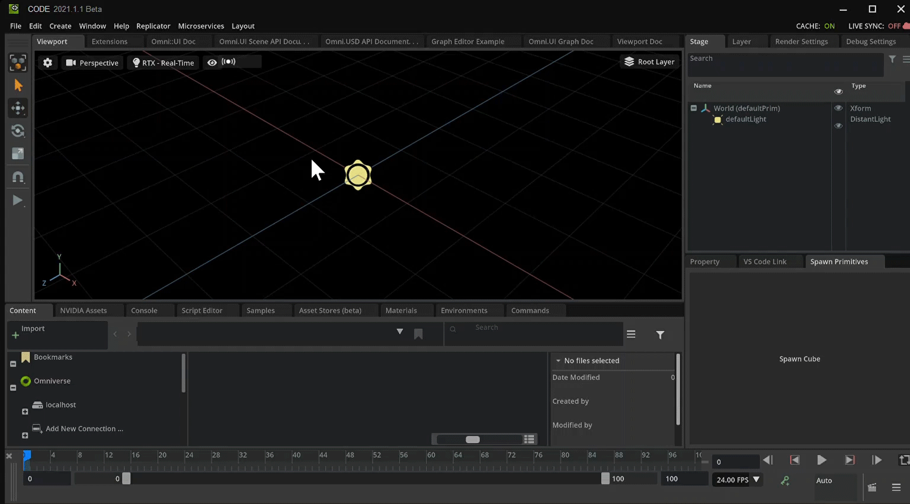
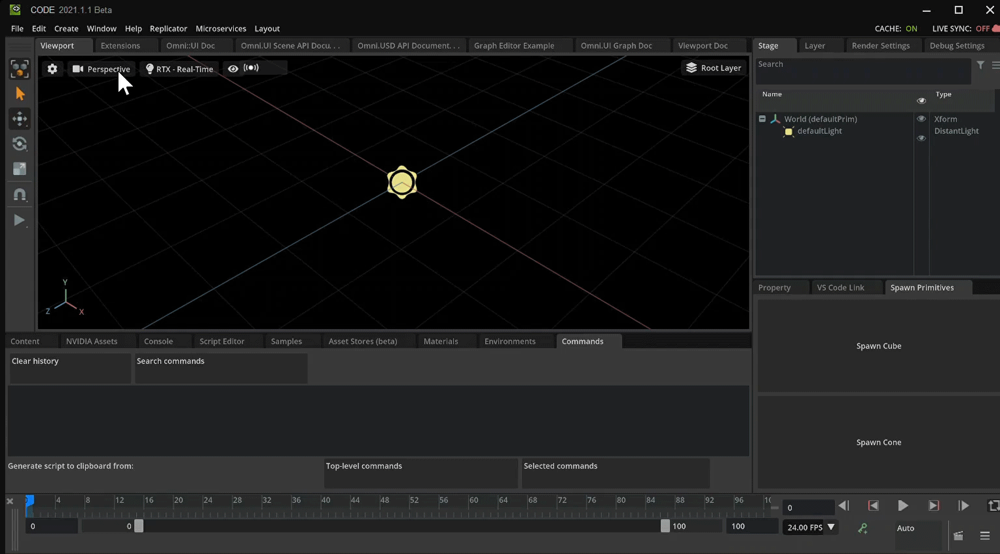

# How to make an Extension To Spawn Primitives

In this document we will be going over how to create an extension inside of Omniverse. Extensions are what Omniverse is made up of. This is ideal for those who are begineers to Omniverse Kit.

# Learning Objects
- How to create an extension
- How to use Omni commands in code
- How to make a functional button
- Update the extension's title and description
- Docking the extension window

# Prereqs.
- [Setup Environment](https://github.com/NVIDIA-Omniverse/ExtensionEnvironmentTutorial/blob/master/Tutorial.md#4-create-a-git-repository)
- Omniverse Code 2022.1.1 or higher


# Table of Contents
- [Step 1: Creating an Extension](#step-1-creating-an-extension)
    - [Step 1.1: Locating the Extension Manager](#step-11-locating-the-extension-manager)
    - [Step 1.2: Create Template Extension](#step-12-create-template-extension)
    - [Step 1.3: Updating the .toml File](#step-13-updating-the-toml-file)
- [Step 2: Changing the code](#step-2-changing-the-code)
    - [Step 2.1: Update the text](#step-21-update-the-text)
    - [Step 2.2: Docking the Extension Window](#step-22-docking-the-extension-window)
- [Step 3: Omniverse Commands; Spawn a Cube](#step-3-omniverse-commands-spawn-a-cube)
    - [Step 3.1: Omniverse Commands Intro](#step-31-omniverse-commands-intro)
    - [Step 3.2: Getting the Command Code](#step-32-getting-the-command-code)
    - [Step 3.3: Using the Command in an Extension](#step-33-using-the-command-in-an-extension)
- [Step 4: Spawn a Cone](#step-4-spawn-a-cone)
    - [Step 4.1: Setup for Spawn Cone](#step-41-setup-for-spawn-cone)
    - [Step 4.2: Updating on_click()](#step-42-updating-onclick)
- [Step 5: Conclusion](#step-5-conclusion)

## Step 1: Creating an Extension

Omniverse is made up of all kinds of extensions that were created by developers. In this section we will show how to create an extension and show how the code gets reflected back into Omniverse.

<br>

### Step 1.1: Locating the Extension Manager


```Step 1.1.1:``` Once Omniverse Code is open select the `Extensions` Manager in the top right.

We can also view other extensions through this tab. If ```Extensions``` tab is not visible make sure it is checked in the Windows tab.
<br>


### Step 1.2: Create template extension


```Step 1.2.1:``` At the top left find the plus ➕ icon. Click this icon and select ```New Extension Template Project``` to begin creating an extension.

|  |  |
|------ |------ |


From here another window will popup prompting on where to place the folder. For this example we will create it in the default location. 

```Step 1.2.2:``` Once the save location is selected, hit `Create`



Then it will prompt for a Project Folder Name and Extension Name. 

```Step 1.2.3:``` Enter a Project Folder Name and Extension Name.

For this example we chose `kit-extension-sample-spawn_prims` for the Project Folder Name and `omni.example.spawn_prims` for our Extension Name.

> 📝 **Note:** Choose the name of an extension differently for publishing. We suggest ```companyName.extdescrip1.descrip2``` 

|  |  |
| --- | --- |


<br><br>

> 📝 **Note:** To learn more about the Extension Manager head over to our documentations [here](https://docs.omniverse.nvidia.com/app_code/prod_extensions/ext_extension-manager.html?). 

<br><br>


After choosing the Extension Name two things will happen.
1. Visual Studio Code will start up displaying the template code
2. A new window will appear called "My Window" in Omniverse

|  |  |
| ------ | ------ |

Now that we created a new extension template, there will be a ```Click Me``` button. When clicked, a message in the Console Window in Omniverse Code recording that the button was clicked. We will use this button later to spawn a primitive.

Below is a visual to see the button in action.

> 💡 **Tip:** If unsure where to locate the console, look to the bottom of Omniverse Code. There are tables listed *Content, NVIDIA Assets, Script Editor, etc*. Console should be listed there. If not try going to the top bar then select *Window>Utilities>Console*. Make sure there is a check mark next to Console and if not then select it for the window to show up.


### Step 1.3: Updating the .toml File

With our extension created we can also update how our extension will be viewed in the Extensions Tab. This is all done inside of the .toml file that comes with the template extension. Locate it inside of Visual Studio Code under the `config` folder. The file is called `extension.toml`.

```Step 1.3.1:``` Double click `extension.toml` to open it.



Heres a snippet of what will be inside of extension.toml

``` python
[package]
# Semantic Versionning is used: https://semver.org/
version = "1.0.0"

# The title and description fields are primarily for displaying extension info in UI
title = "Simple UI Extension Template"
description="The simplest python extension example. Use it as a starting point for your extensions."

# Path (relative to the root) or content of readme markdown file for UI.
readme  = "docs/README.md"

# URL of the extension source repository.
repository = ""

# One of categories for UI.
category = "Example"

# Keywords for the extension
keywords = ["kit", "example"]


# Use omni.ui to build simple UI
[dependencies]
"omni.kit.uiapp" = {}

# Main python module this extension provides, it will be publicly available as "import omni.hello.world".
[[python.module]]
name = "omni.example.spawn_prims"
```

For now we will update the title and description variable. 

```Step 1.3.2:``` Change the title and description in the .toml file.

We changed the title to *Spawn Primitives* and gave a short description how it spawns different primitives.

``` python
title = "Spawn Primitives"
description="Spawns different primitives utilizing omni kit's commands"
```

```Step 1.3.3:``` Save the file and head back over into Omniverse. 

```Step 1.3.4:``` Select the Extension Tab and search for the title of the Extension

```Step 1.3.5:``` Once found, select it to pull up it's information. 

Here we can see that the title and description are present in the extension info. 



## Step 2: Changing the Code

Now that template is created, we can actually start changing some parts in the code and see it reflected in our extension. Let's take a look at the code.

``` python
import omni.ext
import omni.ui as ui

# Any class derived from `omni.ext.IExt` in top level module (defined in `python.modules` of `extension.toml`) will be
# instantiated when extension gets enabled and `on_startup(ext_id)` will be called. Later when extension gets disabled
# on_shutdown() is called.
class MyExtension(omni.ext.IExt):
    # ext_id is current extension id. It can be used with extension manager to query additional information, like where
    # this extension is located on filesystem.
    def on_startup(self, ext_id):
        print("[omni.example.spawn_prims] MyExtension startup")

        self._window = ui.Window("My Window", width=300, height=300)
        with self._window.frame:
            with ui.VStack():
                ui.Label("Some Label")

                def on_click():
                    print("clicked!")

                ui.Button("Click Me", clicked_fn=lambda: on_click())

    def on_shutdown(self):
        print("[omni.example.spawn_prims] MyExtension shutdown")
```

### Step 2.1: Update the text

To understand how this template works we will start with changing some values around to help better reflect what our extension does. 

```Step 2.1.1:``` Currently, our extension window says `My Window` so we will want to change that to `Spawn Primitives`

``` python
        self._window = ui.Window("Spawn Primitives", width=300, height=300)
```

```Step 2.1.2:``` Remove `ui.Label("Some Label")`

``` python
        self._window = ui.Window("Spawn Primitives", width=300, height=300)
        with self._window.frame:
            with ui.VStack():
                
                ui.Label("Some Label") # DELETE THIS LINE
                
                def on_click():
                    print("clicked!")
```

```Step 2.1.3:``` Update the Button's text to say `Spawn Cube`.


``` python
                ui.Button("Spawn Cube", clicked_fn=lambda: on_click())
```

After making those changes the code should look as follows:

``` python
import omni.ext
import omni.ui as ui

# Any class derived from `omni.ext.IExt` in top level module (defined in `python.modules` of `extension.toml`) will be
# instantiated when extension gets enabled and `on_startup(ext_id)` will be called. Later when extension gets disabled
# on_shutdown() is called.
class MyExtension(omni.ext.IExt):
    # ext_id is current extension id. It can be used with extension manager to query additional information, like where
    # this extension is located on filesystem.
    def on_startup(self, ext_id):
        print("[omni.example.spawn_prims] MyExtension startup")

        self._window = ui.Window("Spawn Primitives", width=300, height=300)
        with self._window.frame:
            with ui.VStack():

                def on_click():
                    print("clicked!")

                ui.Button("Spawn Cube", clicked_fn=lambda: on_click())

    def on_shutdown(self):
        print("[omni.example.spawn_prims] MyExtension shutdown")
```

```Step 2.1.4:``` Save the file before going back into Omniverse. 

```Step 2.1.5:``` Go to Omniverse and look at the new window. 

Now we will be able to see our new window with a giant button saying "Spawn Cube".




### Step 2.2 Docking the Extension Window

The window has been floating in space so far. As we continue we will want to keep it in a spot we know it will be in to make sure we do not lose sight of it. Omniverse allows one to move their extensions and dock them in any location. In order to dock the extensions simply click, hold, and drag to the desired location.


## Step 3: Omniverse Commands; Spawn a Cube

Our button right now is a bit misleading. Just because it says "Spawn Cube", does not mean it will spawn a cube. The functionality for clicking on the button still persists where it will print to the console. Let's change this by using Kit commands.

### Step 3.1 Omniverse Commands Intro

Commands are actions that take place inside of Omniverse. A simple command could be creating an object or changing a color. Commands are composed of a `do` and an `undo` feature. To read more about what commands are and how to create custom commands go [here](https://docs.omniverse.nvidia.com/py/kit/source/extensions/omni.kit.commands/docs/index.html).

Omniverse allows users / developers to see what commands are taking place as they work in the application. On the right side, there will be a window called `Commands` and this is where we can visually see what commands are taking place as we work. 

```Step 3.1.1:``` For our purposes we will be moving this window to get a better view into the dock to the left of it.


```Step 3.1.2:``` To make things more clear we will go ahead and select the `Clear History` button located in the Commands Window. 

That way it will be easier to see what action takes place when we try to create a cube. 


### Step 3.2 Getting the Command Code

Now that we have the necessary tools, let's see how we can grab one of these commands and use it in our extension. The first thing we are going to do is create a cube. There are different ways on how to create our cube but for this example we will go to the top bar.

```Step 3.2.1:``` Select `Create > Mesh > Cube` from the top bar. 

After selecting `Cube` we should see in the Commands window a new line, `CreateMeshPrimWithDefaultXform`, that were not there before and a white cube inside of the viewport.


> 💡 **Tip:** Try to do other actions and see what ends up populating inside of the Commands Window. It can tell what commands or functions are being used for that particular action.

```Step 3.2.2:``` In order to utilize the command for our Extension we are going to select `CreateMeshPrimWithDefaultXform` inside of the Command Window. 

Once we have selected it there is an option to generate script code and copy it to the clipboard.

```Step 3.2.3:``` With `CreateMeshPrimWithDefaultXform` selected click on the button that says `Selected Commands`, then head over to Visual Studio Code.


### Step 3.3 Using the Command in an Extension

```Step 3.3.1:``` With the command copied to our clipboard, paste it into the bottom of our `extension.py` file. 

The code should have the following after pasting:

``` python
import omni.ext
import omni.ui as ui

# Any class derived from `omni.ext.IExt` in top level module (defined in `python.modules` of `extension.toml`) will be
# instantiated when extension gets enabled and `on_startup(ext_id)` will be called. Later when extension gets disabled
# on_shutdown() is called.
class MyExtension(omni.ext.IExt):
    # ext_id is current extension id. It can be used with extension manager to query additional information, like where
    # this extension is located on filesystem.
    def on_startup(self, ext_id):
        print("[omni.example.spawn_prims] MyExtension startup")

        self._window = ui.Window("Spawn Primitives", width=300, height=300)
        with self._window.frame:
            with ui.VStack():

                def on_click():
                    print("clicked!")

                ui.Button("Spawn Cube", clicked_fn=lambda: on_click())

    def on_shutdown(self):
        print("[omni.example.spawn_prims] MyExtension shutdown")

import omni.kit.commands

omni.kit.commands.execute('CreateMeshPrimWithDefaultXform',
	prim_type='Cube')

```

As we can see there is a new import as well as the command which create's a cube.

``` python
import omni.kit.commands

omni.kit.commands.execute('CreateMeshPrimWithDefaultXform',
	prim_type='Cube')
```

```Step 3.3.2:``` Let's move the `import omni.kit.commands` to the top with the other two imports.
```python
import omni.ext
import omni.ui as ui
import omni.kit.commands
```

```Step 3.3.3:``` Place the `omni.kit.commands.execute('CreateMeshPrimWithDefaultXform` inside of the `on_click` function.
``` python
                def on_click():
                    omni.kit.commands.execute('CreateMeshPrimWithDefaultXform',
                        prim_type='Cube')
                    print("clicked!")
```

Before saving make sure the code looks something like this:

``` python
import omni.ext
import omni.ui as ui
import omni.kit.commands

# Any class derived from `omni.ext.IExt` in top level module (defined in `python.modules` of `extension.toml`) will be
# instantiated when extension gets enabled and `on_startup(ext_id)` will be called. Later when extension gets disabled
# on_shutdown() is called.
class MyExtension(omni.ext.IExt):
    # ext_id is current extension id. It can be used with extension manager to query additional information, like where
    # this extension is located on filesystem.
    def on_startup(self, ext_id):
        print("[omni.example.spawn_prims] MyExtension startup")

        self._window = ui.Window("Spawn Primitives", width=300, height=300)
        with self._window.frame:
            with ui.VStack():

                def on_click():
                    omni.kit.commands.execute('CreateMeshPrimWithDefaultXform',
                        prim_type='Cube')
                    print("clicked!")

                ui.Button("Spawn Cube", clicked_fn=lambda: on_click())

    def on_shutdown(self):
        print("[omni.example.spawn_prims] MyExtension shutdown")
```
```Step 3.3.4:``` Save the code then head back into Omniverse.

```Step 3.3.5:``` Test the extension by hitting the `Spawn Cube` button.

 Now that we have gave a bit more functionality to our `on_click` function, lets give it a test. Press the `Spawn Cube` button on our Extension Window. After pressing it we] should see the same functionality for creating a cube so now every time we press `Spawn Cube` it will do the same function as `Create > Mesh > Cube`.
 


Now that we know how to spawn a cube, the challenge is can we spawn a cone? Write the rest of the code to spawn a cone or even spawning all different kinds of Meshs and check in the conclusion section on how we implemented it. 

If more guidance is needed on how to spawn another mesh keep following along.

## Step 4: Spawn a Cone

We know how to spawn a cube but there are still some other Meshs we can spawn, for example a cone. Well how can we spawn a cone? Let's first start with getting another button that is separate from `Spawn Cube`. This time we will call it `Spawn Cone`.

### Step 4.1: Setup for Spawn Cone

```Step 4.1.1:``` Add the line `ui.Button("Spawn Cone", clicked_fn=lambda: on_click())` below the spawn cube button.

``` python
    def on_startup(self, ext_id):
        print("[omni.example.spawn_prims] MyExtension startup")

        self._window = ui.Window("Spawn Primitives", width=300, height=300)
        with self._window.frame:
            with ui.VStack():

                def on_click():
                    omni.kit.commands.execute('CreateMeshPrimWithDefaultXform',
                        prim_type='Cube')
                    print("clicked!")

                ui.Button("Spawn Cube", clicked_fn=lambda: on_click())
                ui.Button("Spawn Cone", clicked_fn=lambda: on_click())
```

```Step 4.1.2:``` Save the file then go back to Omniverse.

With that saved let's go back into Omniverse and see what the outcome is.

<br>

Since both buttons use the same function they both are spawning a cube. Which is *not* the intended funtionality.


Just like how we go the command for creating a Cube, let's get the command for creating a cone. 

```Step 4.1.3:``` Select `Create > Mesh > Cone` on the tab bar.

```Step 4.1.4:``` Copy the command in the `Commands` tab with the `Selected Commands` button.

```Step 4.1.5:``` Paste the code into `extensions.py` inside of Visual Studio Code.

Once the command has been copied and pasted that into Visual Studio Code, we shall compare the different between the two.



Looking at both commands, is there similarities between the two? 

``` python
                def on_click():
                    #Create a Cube
                    omni.kit.commands.execute('CreateMeshPrimWithDefaultXform',
                        prim_type='Cube')

                    #Create a Cone
                    omni.kit.commands.execute('CreateMeshPrimWithDefaultXform',
                        prim_type='Cone')

                    print("clicked!")
```


It appears that the command is the same and only the value for `prim_type` is different. For cube we need to pass `'Cube'` and for cone we need to pass `'Cone'`.

``` python
#Create a Cube
omni.kit.commands.execute('CreateMeshPrimWithDefaultXform',
    prim_type='Cube')

#Create a Cone
omni.kit.commands.execute('CreateMeshPrimWithDefaultXform',
    prim_type='Cone')
```

### Step 4.2 Updating on_click() 
Theres a couple of ways to go about this.
1. We can check to see what prim type gets passed into `on_click`. 
2. We have only one execution call in `on_click` and set `prim_type` to be the corresponding primitive name based on the button.

Besides the two listed above there are many other ways to go about it, for this example we will be using option 2. 

Let's start by changing what gets passed to `on_click`. 

```Step 4.2.1:``` Add a parameter to the function `on_click` called `prim_type`.

``` python
def on_click(prim_type):
```
This value will be used as part of the command execution. We should only have one execute command function call.

```Step 4.2.2:``` Remove the other execute command.

```Step 4.2.3:``` Replace `prim_type='Cube'` with `prim_type=prim_type`.

``` python
omni.kit.commands.execute('CreateMeshPrimWithDefaultXform',
    prim_type=prim_type)
```

The code should look like the following after the changes:

``` python

                def on_click(prim_type):
                    omni.kit.commands.execute('CreateMeshPrimWithDefaultXform',
                        prim_type=prim_type)

                    print("clicked!")
```


Now if we head back to where we created the buttons, let's make sure to pass the appropriate value for Cube and Cone.

```Step 4.2.4:``` Update the `clicked_fn` for both UI Buttons. The two function calls should look like `on_click("Cube")` and `on_click("Cone")`.

``` python

                ui.Button("Spawn Cube", clicked_fn=lambda: on_click("Cube"))
                ui.Button("Spawn Cone", clicked_fn=lambda: on_click("Cone"))
        
```


```Step 4.2.5:``` Save the file and check in Omniverse on how our new extension works.


## Step 5: Conclusion

We were able to create an extension utilizing the template. Where to go from here?

We only covered the two Meshs that can be created but is it possible to code the other Meshs as well? It would look something like this:


To see the full code for it see below.

---

<details> 
    <summary><b>Click to show the Final Code</b></summary>
    
``` python

import omni.ext
import omni.ui as ui
import omni.kit.commands

# Any class derived from `omni.ext.IExt` in top level module (defined in `python.modules` of `extension.toml`) will be
# instantiated when extension gets enabled and `on_startup(ext_id)` will be called. Later when extension gets disabled
# on_shutdown() is called.
class MyExtension(omni.ext.IExt):
    # ext_id is current extension id. It can be used with extension manager to query additional information, like where
    # this extension is located on filesystem.
    def on_startup(self, ext_id):
        print("[omni.example.spawn_prims] MyExtension startup")

        self._window = ui.Window("Spawn Primitives", width=300, height=300)
        with self._window.frame:
            with ui.VStack():

                def on_click(prim_type):
                    omni.kit.commands.execute('CreateMeshPrimWithDefaultXform',
                        prim_type=prim_type)

                    print("clicked!")

                ui.Button("Spawn Cube", clicked_fn=lambda: on_click("Cube"))
                ui.Button("Spawn Cone", clicked_fn=lambda: on_click("Cone"))
                ui.Button("Spawn Cylinder", clicked_fn=lambda: on_click("Cylinder"))
                ui.Button("Spawn Disk", clicked_fn=lambda: on_click("Disk"))
                ui.Button("Spawn Plane", clicked_fn=lambda: on_click("Plane"))
                ui.Button("Spawn Sphere", clicked_fn=lambda: on_click("Sphere"))
                ui.Button("Spawn Torus", clicked_fn=lambda: on_click("Torus"))

    def on_shutdown(self):
        print("[omni.example.spawn_prims] MyExtension shutdown")

```
    
</details>

---
