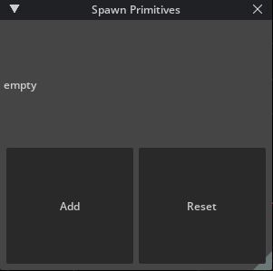
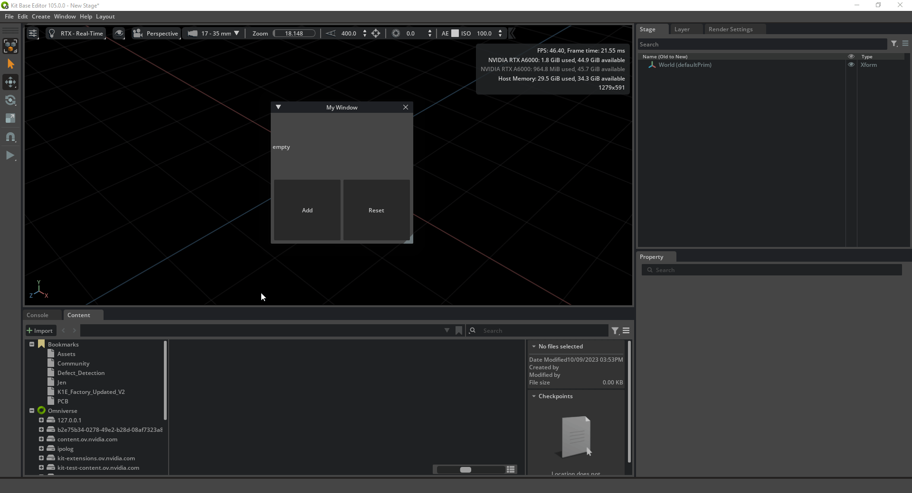
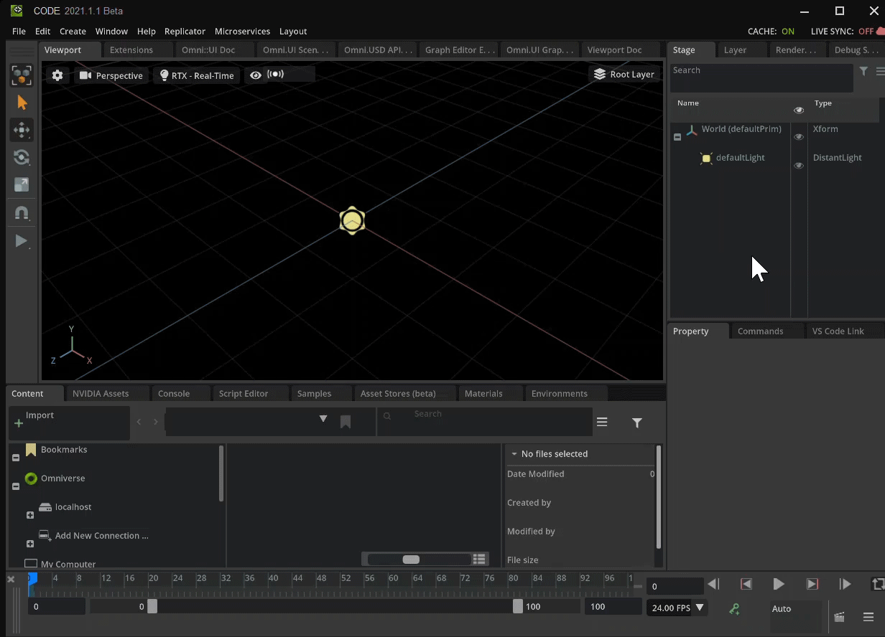
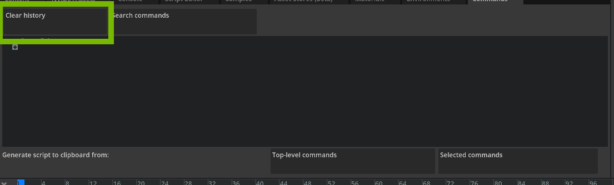
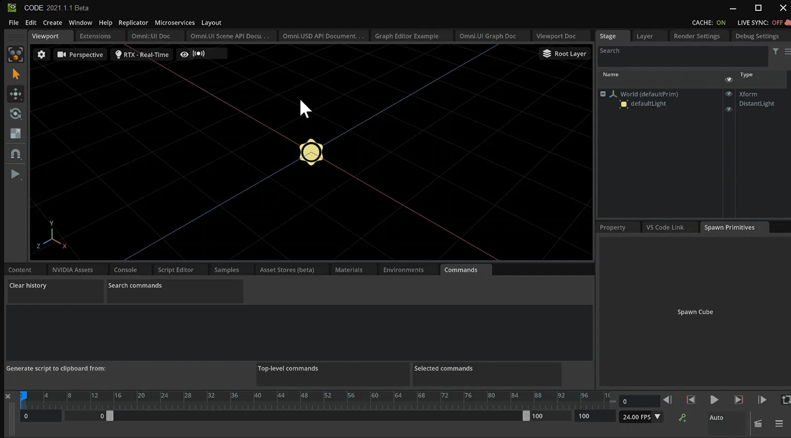
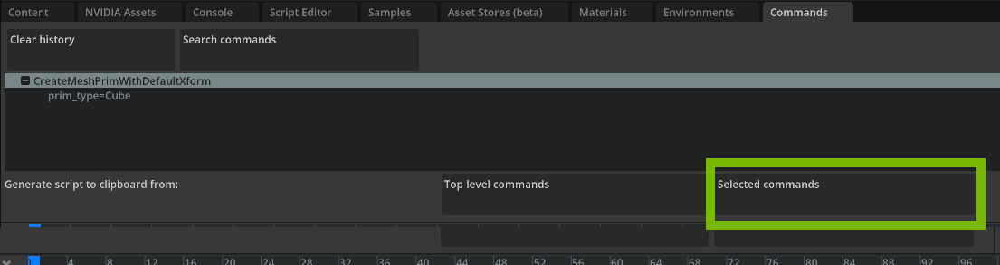

# Make an Extension To Spawn Primitives

In this document you learn how to create an Extension inside of Omniverse. Extensions are what make up Omniverse. This tutorial is ideal for those who are beginners to Omniverse Kit.

## Learning Objectives

- Create an Extension
- Use Omni Commands in Omniverse Code
- Make a functional Button
- Update the Extension's title and description
- Dock the Extension Window

# Prerequisites

- [Set up your environment](https://github.com/NVIDIA-Omniverse/ExtensionEnvironmentTutorial/blob/master/Tutorial.md#4-create-a-git-repository)
- Omniverse Code 2022.1.1 or higher

## Step 1: Create an Extension

Omniverse is made up of all kinds of Extensions that were created by developers. In this section, you create an Extension and learn how the code gets reflected back in Omniverse.

### Step 1.1: Navigate to the Extensions List

In Omniverse Code, navigate to the *Extensions* panel:


> **Note:** If you don't see the *Extensions* panel, enable **Window > Extensions**:
>
> 

### Step 1.2: Create A New Extension Template Project

Click the **plus** icon, and select ```New Extension Template Project``` to create a extension:
    


### Step 1.3: Choose a Location for Your Extension

In the following prompt, select the default location for your Extension, and click **Create**:


### Step 1.4: Name your Extension

Next, name your project "kit-exts-spawn-prims":


And name your Extension "omni.example.spawn_prims":


> **Note:** Choose a different Extension name when publishing. For example: "companyName.extdescrip1.descrip2" 

After this, two things happen.

First, Visual Studio Code starts up, displaying the template Extension code:


Second, a new window appears in Omniverse Code, called "My Window":



If you click **Click Me** in *My Window*, an output message appears in the *Console* in Omniverse Code, stating that the button was clicked:



You use this button later to spawn a primitive.

## Step 2: Update Your Extension's Metadata

With the Extension created, you can update the metadata in `extension.toml`. This is metadata is used in the Extension details of the *Extensions Manager*. It's also used to inform other systems of the Application. 

### Step 2.1: Navigate to `extension.toml`

Navigate to `config/extension.toml`:


### Step 2.2: Name and Describe your Extension

Change the Extension's `title` and `description`:

``` python
title = "Spawn Primitives"
description="Spawns different primitives utilizing omni kit's commands"
```

Save the file and head back over into Omniverse. 

### Step 2.3: Locate the Extension

Select the *Extension* tab, search for your Extension, and select it to pull up its details:


Now that your template is created, you can start editing the source code and see it reflected in Omniverse Code. 

## Step 3: Update Your Extension's Interface

Currently, your window is called "My window", and the button says, "Click Me". In this step, you make some changes to better reflect the purpose of your Extension.

### Step 3.1: Navigate to `extension.py`

Navigate to `omni/spawn/primitives/extension.py` to find the following source code:

``` python
import omni.ext
import omni.ui as ui

# Any class derived from `omni.ext.IExt` in top level module (defined in `python.modules` of `extension.toml`) will be
# instantiated when extension gets enabled and `on_startup(ext_id)` will be called. Later when extension gets disabled
# on_shutdown() is called.
class MyExtension(omni.ext.IExt):
    # ext_id is current extension id. It can be used with extension manager to query additional information, like where
    # this extension is located on filesystem.
    def on_startup(self, ext_id):
        print("[omni.example.spawn_prims] MyExtension startup")

        self._window = ui.Window("My Window", width=300, height=300)
        with self._window.frame:
            with ui.VStack():
                ui.Label("Some Label")

                def on_click():
                    print("clicked!")

                ui.Button("Click Me", clicked_fn=lambda: on_click())

    def on_shutdown(self):
        print("[omni.example.spawn_prims] MyExtension shutdown")
```

Next, change some values to better reflect what your Extension does. 

### Step 3.2: Update the Window Title

Initialize `ui.Window` with the title "Spawn Primitives", instead of "My window":

``` python
self._window = ui.Window("Spawn Primitives", width=300, height=300)
```

### Step 3.3: Remove the Label

Remove the line `ui.Label("Some Label")`

``` python
self._window = ui.Window("Spawn Primitives", width=300, height=300)
with self._window.frame:
    with ui.VStack():
        
        ui.Label("Some Label") # DELETE THIS LINE
        
        def on_click():
            print("clicked!")
```
### Step 3.4: Update the Button Text

Update the `Button` text to "Spawn Cube".

``` python
ui.Button("Spawn Cube", clicked_fn=lambda: on_click())
```

### Step 3.5: Review Your Changes

After making the above changes, your code should read as follows:

``` python
import omni.ext
import omni.ui as ui

# Any class derived from `omni.ext.IExt` in top level module (defined in `python.modules` of `extension.toml`) will be
# instantiated when extension gets enabled and `on_startup(ext_id)` will be called. Later when extension gets disabled
# on_shutdown() is called.
class MyExtension(omni.ext.IExt):
    # ext_id is current extension id. It can be used with extension manager to query additional information, like where
    # this extension is located on filesystem.
    def on_startup(self, ext_id):
        print("[omni.example.spawn_prims] MyExtension startup")

        self._window = ui.Window("Spawn Primitives", width=300, height=300)
        with self._window.frame:
            with ui.VStack():

                def on_click():
                    print("clicked!")

                ui.Button("Spawn Cube", clicked_fn=lambda: on_click())

    def on_shutdown(self):
        print("[omni.example.spawn_prims] MyExtension shutdown")
```

Save the file, and return to Omniverse Code. There, you'll see your new window with a large button saying "Spawn Cube".


### Step 4: Dock the Extension Window

Omniverse allows you to move Extensions and dock them in any location. To do so, click and drag your window to the desired location.


## Step 5: Prepare Your Commands Window

Commands are actions that take place inside of Omniverse. A simple command could be creating an object or changing a color. Commands are composed of a `do` and an `undo` feature. To read more about what commands are and how to create custom commands, read our [documentation](https://docs.omniverse.nvidia.com/py/kit/source/extensions/omni.kit.commands/docs/index.html).

Omniverse allows users and developers to see what commands are being executed as they work in the application. You can find this information in the *Commands* window:


You'll use this window to understand what your code is doing.

### Step 5.1: Move Your Commands Window

Move the Commands window to get a better view, or dock it somewhere convenient:



### Step 5.2: Clear Old Commands

Select the **Clear History** button in the *Commands* window. This makes it easier to see what action takes place when you try to create a cube: 



### Step 6: Getting the Command Code

Now that you have the necessary tools, you learn how you can grab one of these commands and use it in the extension. Specifically, you use it create a cube. There are different ways you can create the cube, but for this example, you use **Create** menu in the top bar.

### Step 6.1: Create a Cube

Click **Create > Mesh > Cube** from the top bar:



In the *Viewport*, you'll see your new cube. In the *Commands Window*, you'll see a new command.

### Step 6.2: Copy the Create Mesh Command

Select the new line **CreateMeshPrimWithDefaultXform** in the Command Window, then click **Selected Commands** to copy the command to the clipboard:



### Step 6.3: Use the Command in Your Extension

Paste the copied command into the bottom of the `extension.py` file. The whole file looks like this:

``` python
import omni.ext
import omni.ui as ui

# Any class derived from `omni.ext.IExt` in top level module (defined in `python.modules` of `extension.toml`) will be
# instantiated when extension gets enabled and `on_startup(ext_id)` will be called. Later when extension gets disabled
# on_shutdown() is called.
class MyExtension(omni.ext.IExt):
    # ext_id is current extension id. It can be used with extension manager to query additional information, like where
    # this extension is located on filesystem.
    def on_startup(self, ext_id):
        print("[omni.example.spawn_prims] MyExtension startup")

        self._window = ui.Window("Spawn Primitives", width=300, height=300)
        with self._window.frame:
            with ui.VStack():

                def on_click():
                    print("clicked!")

                ui.Button("Spawn Cube", clicked_fn=lambda: on_click())

    def on_shutdown(self):
        print("[omni.example.spawn_prims] MyExtension shutdown")

import omni.kit.commands

omni.kit.commands.execute('CreateMeshPrimWithDefaultXform',
    prim_type='Cube')
```

You added a new import and a command that creates a cube.

### Step 6.4: Group Your Imports

Move the import statement to the top of the module with the other imports:

```python
import omni.ext
import omni.ui as ui
import omni.kit.commands
```

### Step 6.5: Relocate Create Command

Place `omni.kit.commands.execute()` inside the `on_click()` definition.

``` python
def on_click():
    omni.kit.commands.execute('CreateMeshPrimWithDefaultXform',
        prim_type='Cube')
    print("clicked!")
```

#### Step 6.6: Review and Save

Ensure your code matches ours:

``` python
import omni.ext
import omni.ui as ui
import omni.kit.commands

# Any class derived from `omni.ext.IExt` in top level module (defined in `python.modules` of `extension.toml`) will be
# instantiated when extension gets enabled and `on_startup(ext_id)` will be called. Later when extension gets disabled
# on_shutdown() is called.
class MyExtension(omni.ext.IExt):
    # ext_id is current extension id. It can be used with extension manager to query additional information, like where
    # this extension is located on filesystem.
    def on_startup(self, ext_id):
        print("[omni.example.spawn_prims] MyExtension startup")

        self._window = ui.Window("Spawn Primitives", width=300, height=300)
        with self._window.frame:
            with ui.VStack():

                def on_click():
                    omni.kit.commands.execute('CreateMeshPrimWithDefaultXform',
                        prim_type='Cube')
                    print("clicked!")

                ui.Button("Spawn Cube", clicked_fn=lambda: on_click())

    def on_shutdown(self):
        print("[omni.example.spawn_prims] MyExtension shutdown")
```

Save your code, and switch back to Omniverse.

### Step 7: Test Your Work 

In Omniverse Code, test your extension by clicking **Spawn Cube**. You should see that a new Cube prim is created with each button press.
 


Excellent, you now know how to spawn a cube using a function. What's more, you didn't have to reference anything as Omniverse Code was kind enough to deliver everything you needed.

Continuing on and via same methods, construct a second button that spawns a cone in the same interface.

## Step 8: Spawn a Cone

In this step, you create a new button that spawns a cone.
### Step 8.1: Add a Button

Create a new button below the spawn cube button to spawn a cone: 

```python 
def on_startup(self, ext_id):
    print("[omni.example.spawn_prims] MyExtension startup")

    self._window = ui.Window("Spawn Primitives", width=300, height=300)
    with self._window.frame:
        with ui.VStack():

            def on_click():
                omni.kit.commands.execute('CreateMeshPrimWithDefaultXform',
                    prim_type='Cube')
                print("clicked!")

            ui.Button("Spawn Cube", clicked_fn=lambda: on_click())
            ui.Button("Spawn Cone", clicked_fn=lambda: on_click())
```

### Step 8.2: Save and Review

Save the file, switch back to Omniverse, and test your new button:


Notice that both buttons use the same function and, therefore, both spawn a `Cube`, despite their labels.

## Step 8.3: Create a Cone from the Menu

Using the same *Create* menu in Omniverse Code, create a Cone (**Create > Mesh > Cone**).

### Step 8.4: Copy the Commands to your Extension

Copy the command in the *Commands* tab with the **Selected Commands** button.

### Step 8.5: Implement Your New Button

Paste the command into `extensions.py` like you did before:


``` python
def on_click():
    #Create a Cube
    omni.kit.commands.execute('CreateMeshPrimWithDefaultXform',
        prim_type='Cube')

    #Create a Cone
    omni.kit.commands.execute('CreateMeshPrimWithDefaultXform',
        prim_type='Cone')

    print("clicked!")
```

Notice the command is the same, and only the `prim_type` is different:

- To spawn cube you pass `'Cube'`
- To spawn a cone you pass `'Cone'`

### Step 8.6: Pass the Prim Type to `on_click()` 

Add a `prim_type` argument to `on_click()`:

``` python
def on_click(prim_type):
```

With this value, you can delete the second `omni.kit.commands.execute()` call. Next, you'll use `prim_type` to determine what shape to create.

### Step 8.7: Replace Prim Type 

Replace `prim_type='Cube'` with `prim_type=prim_type`:

``` python
omni.kit.commands.execute('CreateMeshPrimWithDefaultXform',
    prim_type=prim_type)
```

`on_click()` should now look like this:

``` python
def on_click(prim_type):
    omni.kit.commands.execute('CreateMeshPrimWithDefaultXform',
        prim_type=prim_type)

    print("clicked!")
```

### Step 8.8: Pass the Prim Type to `on_click()`

Update the `clicked_fn` for both UI Buttons to pass the `prim_type`: 

``` python
ui.Button("Spawn Cube", clicked_fn=lambda: on_click("Cube"))
ui.Button("Spawn Cone", clicked_fn=lambda: on_click("Cone"))
```

### Step 8.9: Save and Test

Save the file, and test the updates to your *Spawn Primitives* Extension:


## Step 9: Conclusion

Great job! You've successfully created a second button that spawns a second mesh, all within the same Extension. This, of course, can be expanded upon.  

> **Optional Challenge:** Add a button for every mesh type on your own.  
> 
> 
> 
> Below you can find a completed "cheat sheet" if you need help or just want to copy it for your own use.
> 
> <details> 
>     <summary><b>Click to show the final code</b></summary>
> 
> ```  
> import omni.ext
> import omni.ui as ui
> import omni.kit.commands
> 
> # Any class derived from `omni.ext.IExt` in top level module (defined in `python.modules` of `extension.toml`) will be
> # instantiated when extension gets enabled and `on_startup(ext_id)` will be called. Later when extension gets disabled
> # on_shutdown() is called.
> class MyExtension(omni.ext.IExt):
>     # ext_id is current extension id. It can be used with extension manager to query additional information, like where
>     # this extension is located on filesystem.
>     def on_startup(self, ext_id):
>         print("[omni.example.spawn_prims] MyExtension startup")
> 
>         self._window = ui.Window("Spawn Primitives", width=300, height=300)
>         with self._window.frame:
>             with ui.VStack():
> 
>                 def on_click(prim_type):
>                     omni.kit.commands.execute('CreateMeshPrimWithDefaultXform',
>                         prim_type=prim_type)
> 
>                     print("clicked!")
> 
>                 ui.Button("Spawn Cube", clicked_fn=lambda: on_click("Cube"))
>                 ui.Button("Spawn Cone", clicked_fn=lambda: on_click("Cone"))
>                 ui.Button("Spawn Cylinder", clicked_fn=lambda: on_click("Cylinder"))
>                 ui.Button("Spawn Disk", clicked_fn=lambda: on_click("Disk"))
>                 ui.Button("Spawn Plane", clicked_fn=lambda: on_click("Plane"))
>                 ui.Button("Spawn Sphere", clicked_fn=lambda: on_click("Sphere"))
>                 ui.Button("Spawn Torus", clicked_fn=lambda: on_click("Torus"))
> 
>     def on_shutdown(self):
>         print("[omni.example.spawn_prims] MyExtension shutdown")
> ```
> 
> </details>